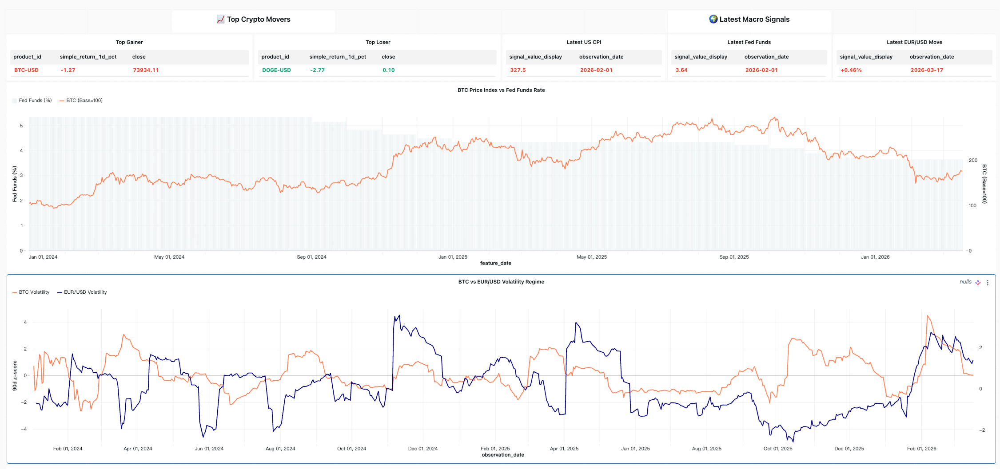
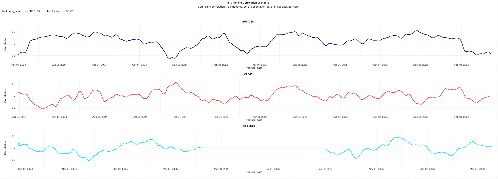
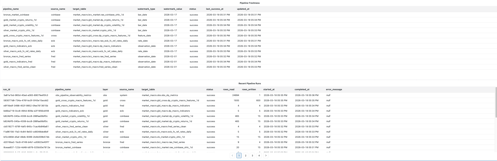

# Market Macro Lakehouse

Production-style Databricks lakehouse for crypto market and macroeconomic data pipelines, analytics products, observability, and dashboard delivery.

- Multi-source ingestion from Coinbase, ECB, and FRED
- Bronze / Silver / Gold / Cross data products on Delta Lake
- Serverless orchestration, dashboard refresh, and operational monitoring
- Thin notebooks + reusable Python pipelines, CI, and unit tests

Quick links:
- [Runbook](docs/runbook.md)
- [Dashboard Guide](docs/dashboard.md)
- [Job Operations](docs/job-operations.md)
- [Architecture Source](docs/assets/market_macro_architecture.drawio)

## Why This Project

This repository is designed to demonstrate production-style data engineering on Databricks rather than exploratory notebook work.

It combines ingestion, transformation, analytics modeling, observability, CI, deployment automation, and AI/BI dashboard delivery in one coherent platform.

The project supports both historical backfill and daily incremental execution and is structured around a thin notebook + heavy Python module pattern.

## Architecture

The platform follows a Databricks medallion design with a reusable execution layer and operational monitoring.

- Source ingestion starts from Coinbase, ECB, and FRED
- Thin notebooks trigger reusable Python pipelines in `src/lakehouse`
- Data is modeled through Bronze, Silver, Gold, and Cross layers
- Observability tables capture pipeline runs, ingestion state, and DQ metrics
- Delivery is automated through Databricks Asset Bundles, serverless jobs, and dashboards


*Production architecture for the Databricks market-macro lakehouse, showing source ingestion, execution/orchestration, medallion data flow, and delivery-ready engineering structure.*

Architecture legend:
- Green arrows: source ingestion flow from external APIs into notebook entrypoints
- Blue arrows: deployment and orchestration flow across bundles, jobs, notebooks, and reusable pipelines
- Purple arrows: layer-specific pipeline writes and Delta merge operations into medallion tables
- Gray dashed arrows: runtime configuration inputs and side-path quality control handling

Architecture source:
- [docs/assets/market_macro_architecture.drawio](docs/assets/market_macro_architecture.drawio)

## What It Produces

### Market products

- `gld_market.dp_crypto_returns_1d`
- `gld_market.dp_crypto_volatility_1d`

### Macro products

- `gld_macro.dp_macro_indicators`
- `slv_macro.ecb_fx_ref_rates_daily`
- `slv_macro.fred_series_clean`

### Cross-domain products

- `gld_cross.dp_crypto_macro_features_1d`
- Dashboard-oriented datasets for crypto movers, macro signals, volatility regimes, and correlation views

### Operational products

- `obs.obs_pipeline_run_log`
- `obs.obs_ingestion_state`
- `obs.obs_dq_metrics`

## Dashboard Highlights

The dashboard is designed as a production-style analytics surface rather than a notebook demo.

### Overview page



Overview page showing:
- `Top Crypto Movers`
- `Latest Macro Signals`
- `BTC Price Index vs Fed Funds Rate`
- `BTC vs EUR/USD Volatility Regime`

### Analytics view



Analytics view highlighting:
- `BTC Rolling Correlation vs Macro`
- EUR/USD, US CPI, and Fed Funds relationship monitoring
- Smoothed cross-domain signal behavior for exploratory analysis

### Pipeline health page



Operational monitoring page covering:
- `Pipeline Freshness`
- `Recent Pipeline Runs`
- Data freshness, recent execution status, and end-to-end workflow visibility

## Production Engineering Features

- Idempotent Delta `MERGE`-based batch pipelines
- Historical backfill and daily incremental execution modes
- Thin notebook + heavy Python module architecture
- Data quality rules with quarantine tables
- Observability tables for runs, freshness, and DQ metrics
- Serverless Databricks job orchestration
- Dashboard refresh automation
- GitHub Actions CI and unit test coverage

## Tech Stack

- Databricks
- Apache Spark / PySpark
- Delta Lake
- Python
- SQL
- Databricks Asset Bundles
- GitHub Actions
- Pytest
- Ruff
- AI/BI Dashboards

## Repository Layout

```text
.
├── src/lakehouse/
│   ├── sources/                 # source adapters (coinbase / ecb / fred)
│   ├── common/                  # shared runtime helpers and models
│   ├── pipelines/               # bronze / silver / gold / obs pipeline modules
│   ├── transforms/              # reusable transformation logic
│   └── observability.py         # pipeline run/state helpers
├── notebooks/                   # thin Databricks entry notebooks
├── dashboards/                  # AI/BI dashboard export and SQL datasets
├── docs/                        # runbook, job ops, dashboard notes, architecture
├── tests/unit/                  # unit tests aligned with src layout
├── .github/workflows/ci.yml     # lint + unit test CI
└── databricks.yml               # Databricks bundle definition
```

## Pipeline Execution Order

**1. Platform setup**

- `00_platform_setup_catalog_schema.ipynb`

**2. Bronze ingestion**

- `10_direct_bronze_market_crypto_ingest.ipynb`
- `11_bronze_ecb_ingest.ipynb`
- `12_bronze_fred_ingest.ipynb`

**3. Silver transformation**

- `20_direct_silver_market_crypto_ohlc_1d.ipynb`
- `22_silver_macro_transform.ipynb`

**4. Gold analytics**

- `30_direct_gold_market_crypto_returns_volatility_1d.ipynb`
- `32_gold_macro_indicators.ipynb`
- `40_direct_gold_cross_crypto_macro_features_1d.ipynb`

**5. Observability**

- `70_pipeline_observability_metrics.ipynb`

## Quickstart

1. Deploy the Databricks bundle:

   ```bash
   databricks bundle deploy --target dev
   ```

2. Run the daily workflow manually:

   ```bash
   databricks bundle run market_macro_daily --target dev
   ```

3. Open the AI/BI dashboard and validate:
   - crypto movers and macro signal cards
   - BTC price vs Fed Funds
   - volatility and correlation views
   - pipeline freshness and recent runs

For full operating steps, see the [runbook](docs/runbook.md).

## Documentation

- [Runbook](docs/runbook.md)
- [Dashboard Guide](docs/dashboard.md)
- [Job Operations](docs/job-operations.md)

## Engineering Conventions

- Notebooks contain orchestration and runtime parameters only
- Business logic lives in reusable Python modules
- Each source has isolated parsing and client logic
- Shared runtime logic is centralized in `src/lakehouse/common`
- Dashboard and bundle assets are version-controlled alongside code

## Local Development

### Prerequisites

- Python 3.10+
- Git

### Install dependencies

```bash
python3 -m pip install --upgrade pip
python3 -m pip install -e ".[dev]"
```

### Run checks

```bash
python3 -m ruff check src tests
python3 -m pytest tests/unit -q
```

## Summary

This project demonstrates a portfolio-ready Databricks data platform with:

- reusable multi-source ingestion pipelines
- medallion lakehouse modeling
- cross-domain analytics products
- operational monitoring and DQ controls
- CI-backed engineering workflow
- automated dashboard delivery
